## Carlos Soto

Senior product engineer based in Columbus, Ohio. I'm passionate about building great UIs
and making them accessible to every user, whatever device, ability or assistive
technology they bring. For 5+ years I've done that with React, React Native and
TypeScript, shipping customer-facing web and mobile products used by millions of people.

To me a UI isn't done until it works for everyone: **accessibility** (WCAG, keyboard,
screen readers, reduced motion) is built in from the first component, **end-to-end tests**
cover the flows real users take, and **performance** holds up on real phones.

### What I work with

|                        |                                                                                              |
| ---------------------- | -------------------------------------------------------------------------------------------- |
| **Languages**          | TypeScript, JavaScript, C# (.NET), SQL, HTML, CSS / Sass                                     |
| **Frontend & mobile**  | React, React Native, Expo, Next.js, TanStack Start, Tailwind CSS                             |
| **State & data**       | TanStack Query (React Query), Zustand, Context API, GraphQL, REST                            |
| **Backend & platform** | .NET APIs, Node.js, PostgreSQL / Supabase, Cloudflare Workers, Stripe                        |
| **Testing**            | Playwright (E2E, desktop + mobile), Cypress, Jest, React Testing Library, Vitest, BackstopJS |
| **Accessibility**      | WCAG, axe DevTools, semantic HTML, keyboard and screen reader support, reduced motion        |
| **UI engineering**     | Design systems, Storybook, responsive and cross-browser work                                 |
| **AI-assisted dev**    | Claude Code for planning, refactors, code review, and writing E2E test suites                |

### Projects

**[Closewatch](https://github.com/CMSOTO2/close-watch)** · [getclosewatch.com](https://getclosewatch.com)
A live SaaS I designed, built and run alone. Turns a proposal PDF into a tracked link that
shows who opened it, how long they read the pricing page, and whether it was forwarded.
TanStack Start on Cloudflare Workers, Supabase Postgres with row-level security, Stripe
subscriptions, Playwright E2E suites on desktop Chrome, iPhone Safari and Android Chrome,
and axe accessibility checks (WCAG 2.2 AA, light and dark) on every push in CI.

<table>
  <tr>
    <td align="center" width="33%">
      <picture>
        <source media="(prefers-color-scheme: dark)" srcset="assets/closewatch/closewatch-proposal-dashboard-ranked-by-intent-dark.webp">
        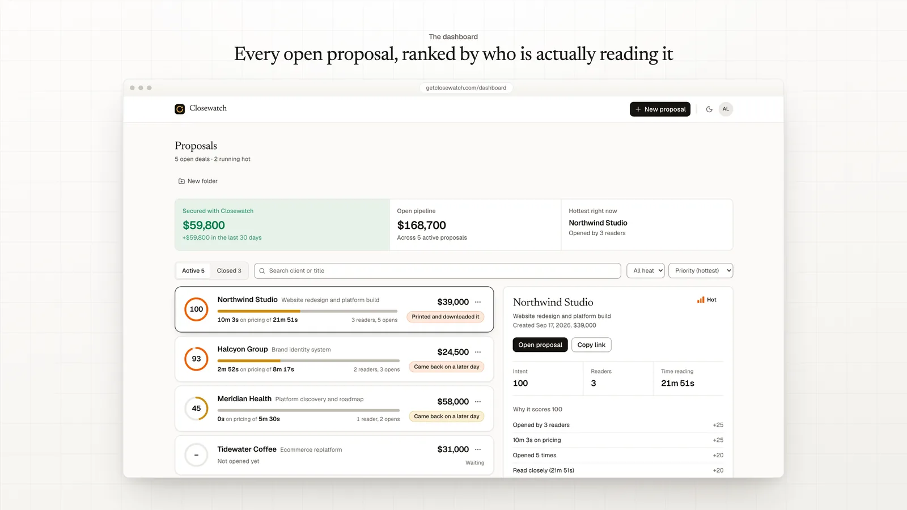
      </picture>
       Proposals ranked by intent
    </td>
    <td align="center" width="33%">
      <picture>
        <source media="(prefers-color-scheme: dark)" srcset="assets/closewatch/closewatch-attention-report-time-per-page-pricing-dark.webp">
        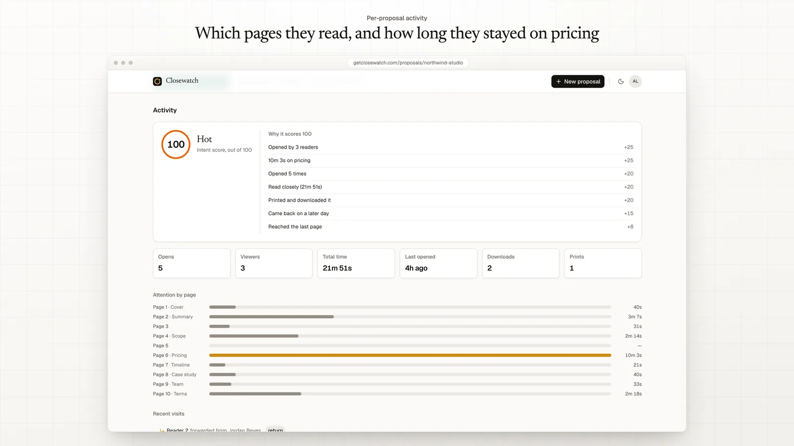
      </picture>
       Time spent on each page
    </td>
    <td align="center" width="33%">
      <picture>
        <source media="(prefers-color-scheme: dark)" srcset="assets/closewatch/closewatch-forwarded-proposal-new-readers-dark.webp">
        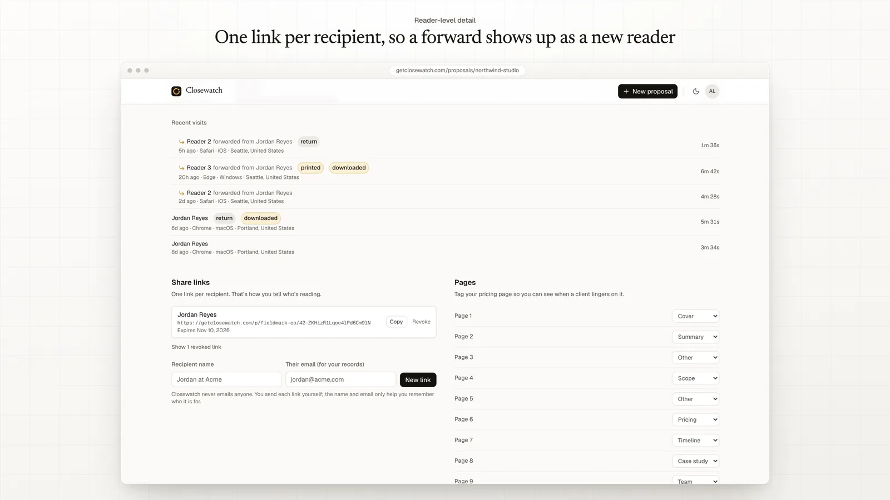
      </picture>
       Forwards show up as new readers
    </td>
  </tr>
</table>

**[Neon Rush](https://github.com/CMSOTO2/neon-rush)**
A 2.5D endless runner for iOS and Android, built with Expo, React Native Skia and
Reanimated at 60/120 FPS. Accessible by design: text scales with Dynamic Type, touch
targets are at least 44 pt, reduce motion is respected, and gameplay cues keep 3:1
contrast for colour-blind players.

<table>
  <tr>
    <td align="center">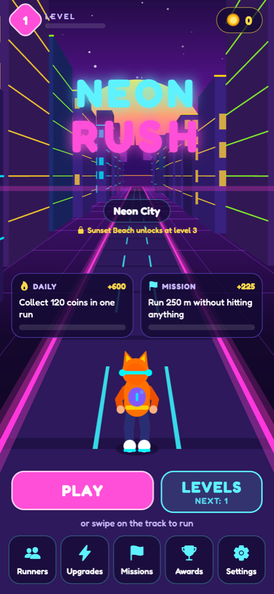 Menu</td>
    <td align="center">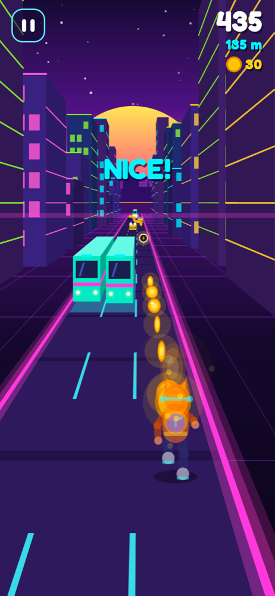 Neon City</td>
    <td align="center">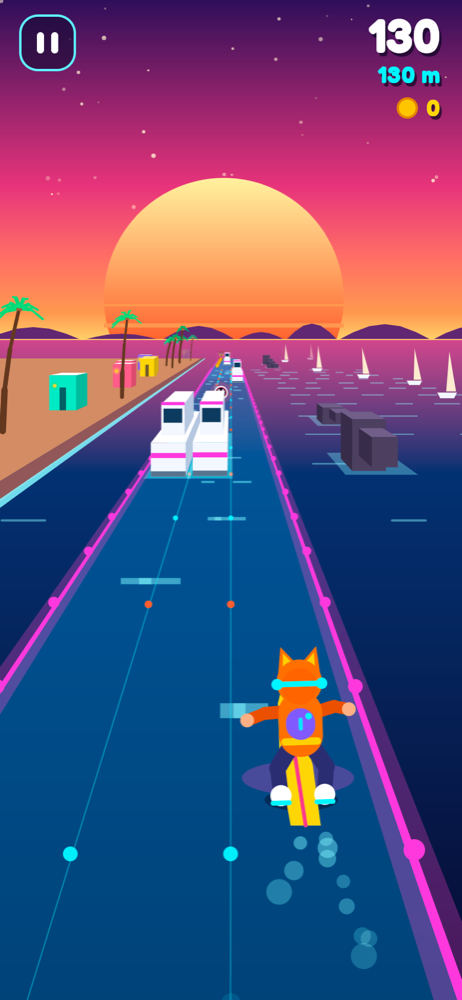 Sunset Beach</td>
    <td align="center">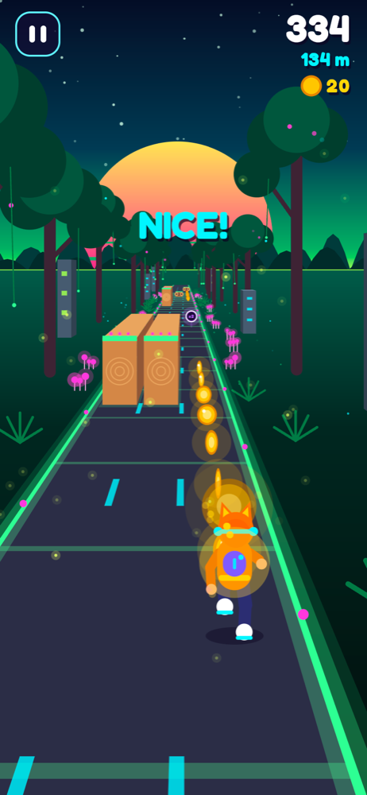 Neon Jungle</td>
    <td align="center">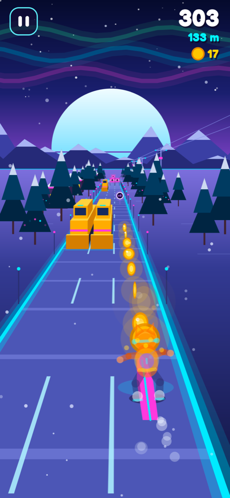 Snowy Mountain</td>
  </tr>
  <tr>
    <td align="center">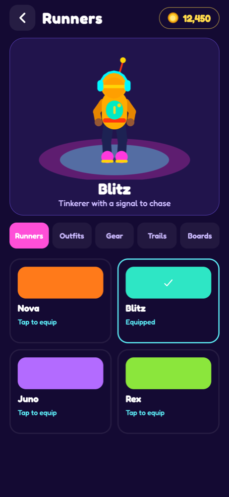 Runners</td>
    <td align="center">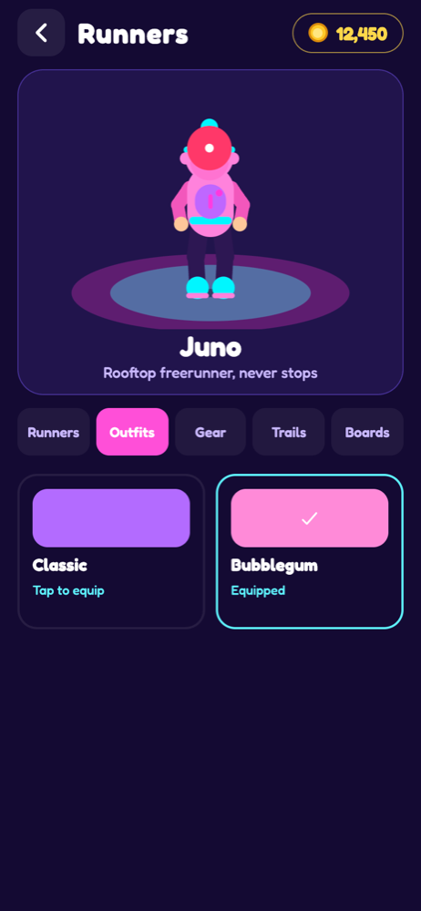 Outfits</td>
    <td align="center">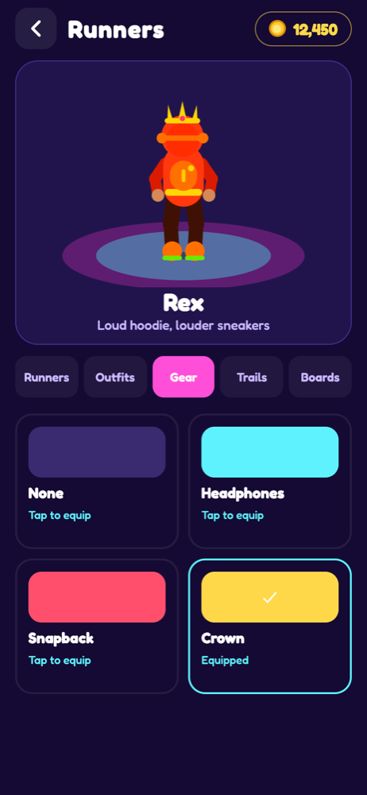 Gear</td>
    <td align="center">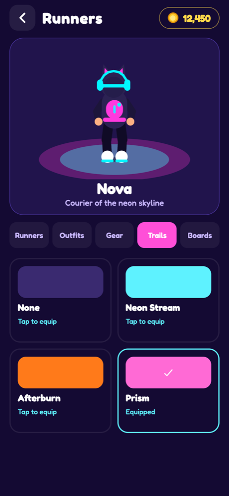 Trails</td>
    <td align="center">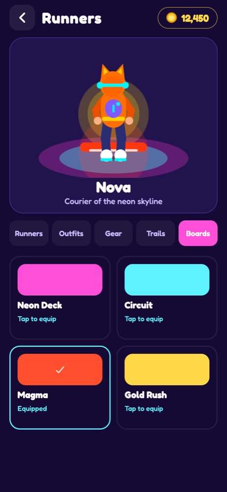 Boards</td>
  </tr>
</table>

**[Global Development Dashboard](https://github.com/CMSOTO2/global-development-dashboard)** · [live demo](https://global-development-dashboard-production.up.railway.app/)
A full-stack data product for exploring GDP, inflation, life expectancy and poverty by
country. React, TypeScript and Visx charts with a world map, a Fastify + SQLite API, and a
Python / Jupyter data pipeline.

<table>
  <tr>
    <td align="center" width="33%">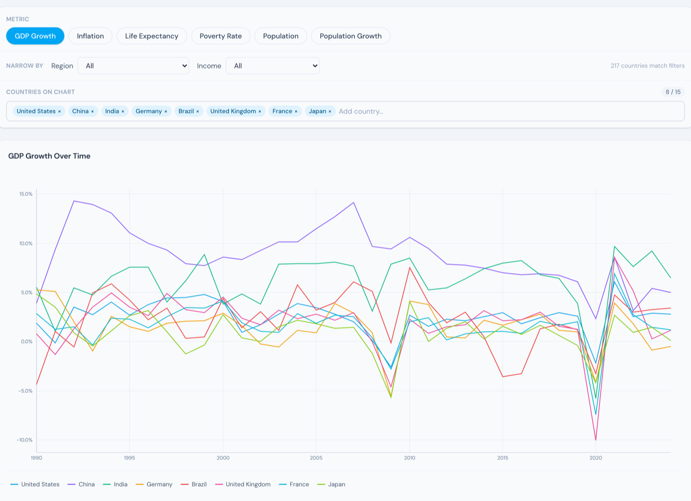 Compare countries over time</td>
    <td align="center" width="33%">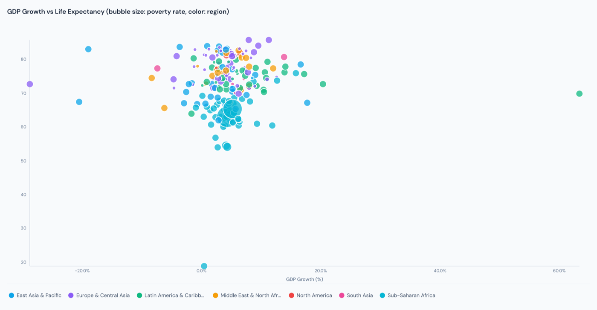 GDP vs life expectancy</td>
    <td align="center" width="33%">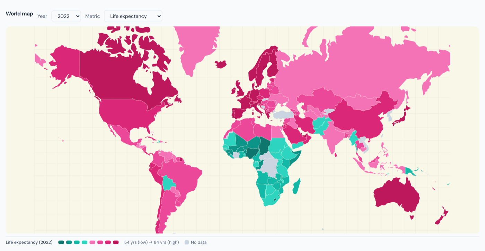 World map by indicator</td>
  </tr>
</table>

### Contact

[LinkedIn](https://www.linkedin.com/in/carlos-m-soto/)
